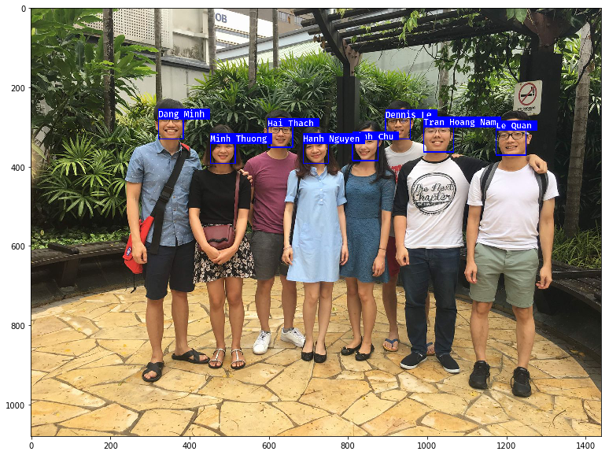

# Real-time-multi-face-recognition

The goal of this project is to build a system that can detect and identify all people whose faces are presented in a picture or real-time captured video. 

The project utilizes [Dlib](http://dlib.net) and [OpenCV](https://opencv.org/) for image processing and face extraction, and the CNN from the [OpenFace project](https://cmusatyalab.github.io/openface/). For more detailed, please take a look at the [jupyter notebook](https://github.com/dmnguyen92/Real-time-multi-face-recognition/blob/master/Real-time%20multiple%20face%20recognition.ipynb). 

**If github fails to display the notebook, you can see the online rendered version [here](https://nbviewer.jupyter.org/github/dmnguyen92/Real-time-multi-face-recognition/blob/master/Real-time%20multiple%20face%20recognition.ipynb)**

